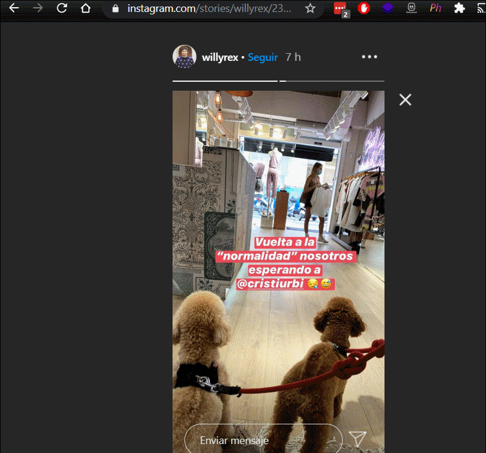

# Photograma 📷

Download Instagram™ stories with a Chrome extension. With just one click, you can save images and videos in your computer, both from highlights and normal stories. 🚀

## Getting started
1. 👉 Clone the repository.
2. 👉 Open the **Extension Management page** in the browser navigating to `chrome://extensions`. Alternatively, you can open the Chrome Menu and go to **More Tools > Extensions**.
3. 👉 Enable the **Developer mode** (top right corner).
4. 👉 Click on **LOAD UNPACKED**.
5. 👉 Navigate to the directory where the repository was cloned.

Remember to refresh the extension on the **Extension Management page** every time you make a change.

## License
This project is licensed under the MIT License - see the [LICENSE](LICENSE) file for details.
